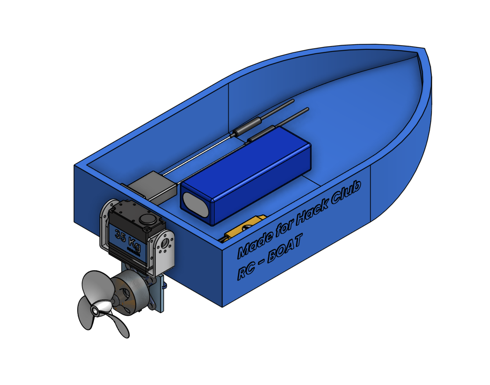
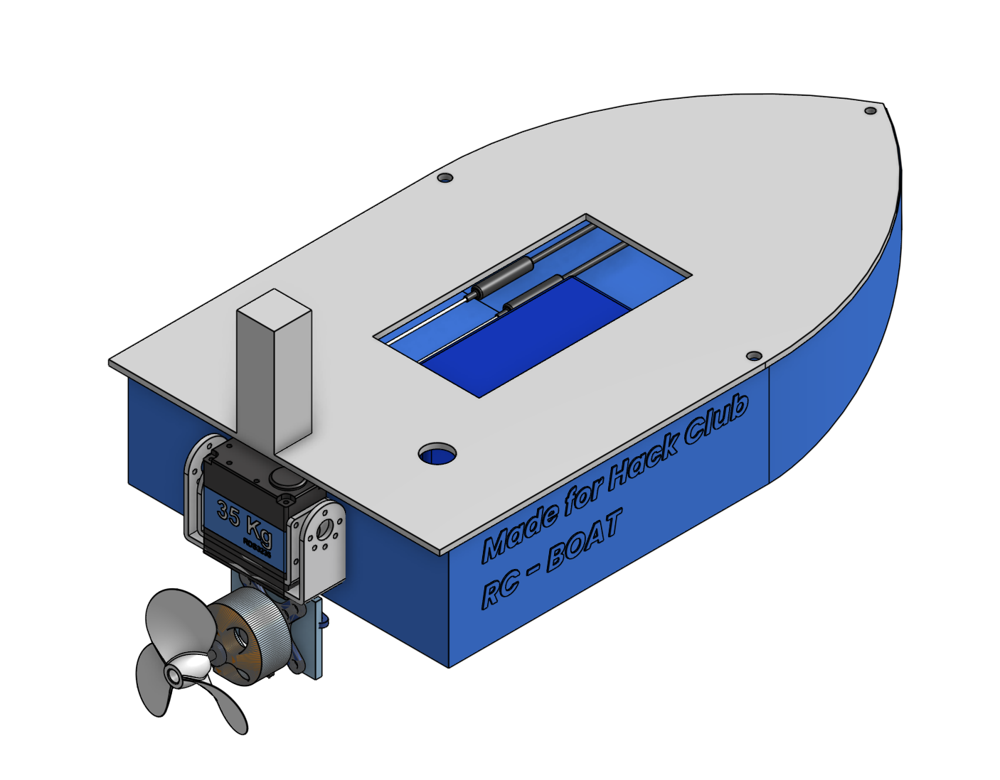

# RG-BOAT

**for hackclub forge**

---

### Open vs. Closed Assembly

| Assembly Open | Assembly Closed |
| :---: | :---: |
|  |  |

### Assembly V1 vs. Assembly V2

| Assembly V1 | Assembly V2 |
| :---: | :---: |
|  |  |

---

Onshape link:  https://cad.onshape.com/documents/da58f6eb132e45c02884e7ef/w/f0726f7543996c3d286e1e4b/e/8387c688005734922322e3be?renderMode=0&uiState=6a95796252a2bebfd142f6c4

## what even is this

its a rc boat i designed in onshape. basically a 3d printed hull that floats and has space for electronics. nothing too crazy but it looks kinda cool ngl

---

## what i got so far

- hull design with curved front and hollow inside (0.25in walls)
  
---

---

- lid that fits on top with a lil overhang so water doesnt get in

---

---

- motor mounts and wire channels inside

took me like a week to figure out onshape but we got there eventually lol

---

## what still needs to happen

gotta actually buy parts and make it move:
- arduino or something similar
- motors + propellers
- esc 
- lipo battery 
- receiver for remote control

also gotta waterproof everything with silicone so it doesnt fry

---

# 🚤 RC BOAT — Bill of Materials (BOM)

> **USD conversion:** 1 USD = NPR 150  
> Prices may vary depending on availability.

| # | Component | Specification / Product | Qty. | Price (NPR) | Price (USD) | Buy Link |
|---|---|---|---:|---:|---:|---|
| 1 | **RC Transmitter + Receiver** | FlySky FS-i6 TX + RX | 1 set | 9,000 | $60.00 | [Buy on Daraz](https://www.daraz.com.np/products/flysky-fs-i6-remote-for-quadcopter-6-channels-for-multiple-control-option-i488181181.html) |
| 2 | **LiPo Battery** | 2200mAh 3S 11.1V LiPo | 1 | 3,500 | $23.16 | [Buy on Daraz](https://www.daraz.com.np/products/2200mah-111v-35c-3s-zop-power-lipo-battery-i130076598.html?spm=a2a0e.store_keyword.list.21.ae781939ZRWD4P) |
| 3 | **Brushless Motor** | 1000KV A2212 Brushless Motor | 1 | 900 | $6.00 | [Buy on Daraz](https://www.daraz.com.np/tag/a2212/) |
| 4 | **Brushless ESC** | 30A Brushless ESC | 1 | 999 | $6.66 | [Buy on Daraz](https://www.daraz.com.np/products/30a-brushless-esc-for-rc-fixed-wing-plane-helicopter-2-3s-i292619586.html) |
| 5 | **Servo Motor** | Metal Gear MG90S Servo | 1 | 415 | $2.77 | [Buy on Daraz](https://www.daraz.com.np/tag/servo-mg/) |
| 6 | **3D Printing** | PLA filament — 158.75 g, approx. 17h 18m print | 1 | 476 | $3.17 | — |

## 💰 Total Cost

| Category | Amount |
|---|---:|
| Components | **NPR 14,200** |
| 3D Printing | **NPR 476** |
| **TOTAL** | **NPR 14,670** |
| **TOTAL (USD)** | **$97.09** |

> **Note:** 3D printing cost is calculated from approximately **158.75 g of PLA filament**, with an estimated material cost of **$3.17**.
---

---

## why im doing this

honestly i just wanted to build something that actually moves. CAD was fun but seeing it in the water is gonna hit different. plus if this works i can add sensors and make it do cooler stuff later

wish me luck fr 
