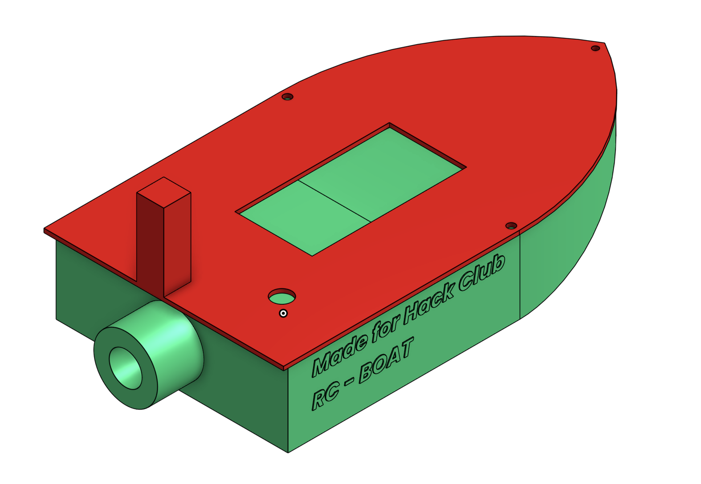
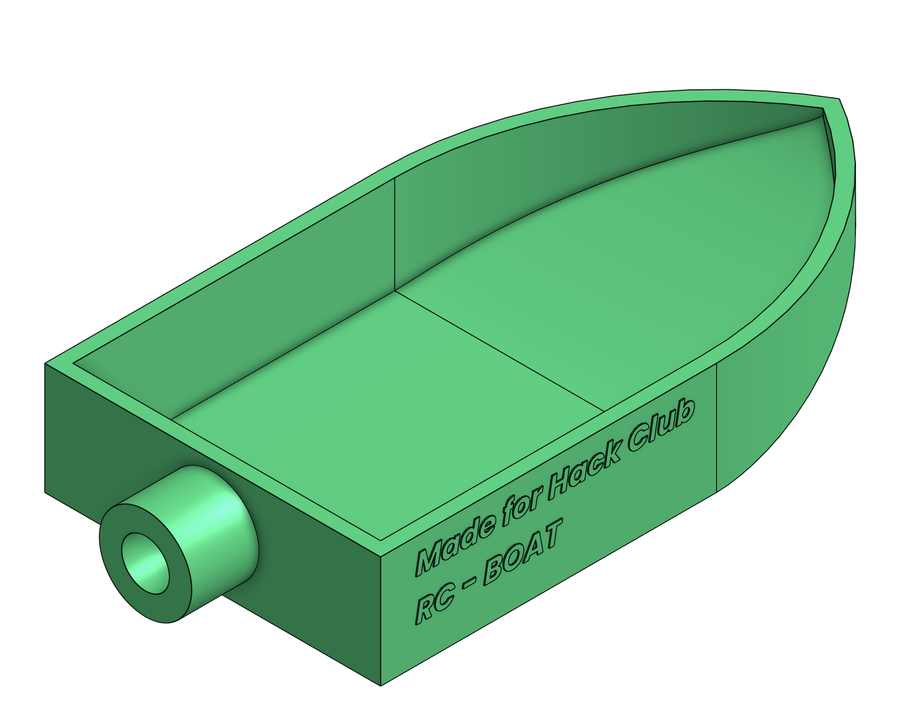
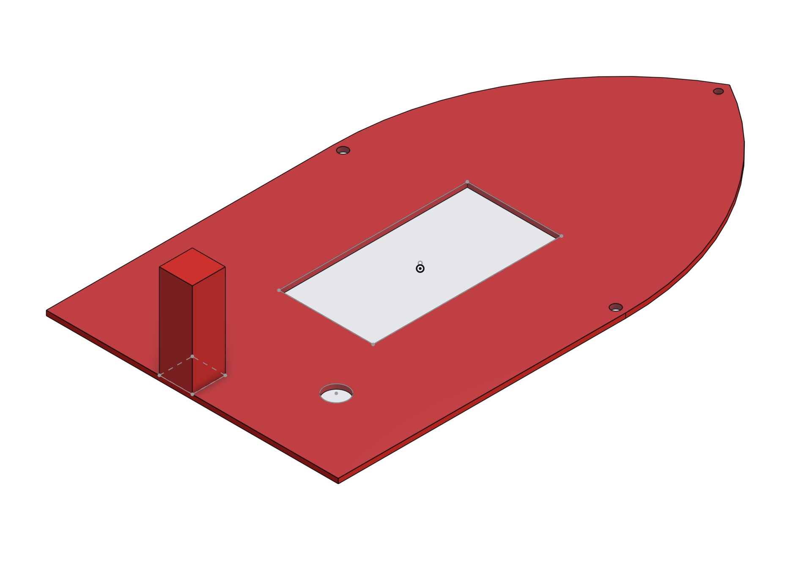
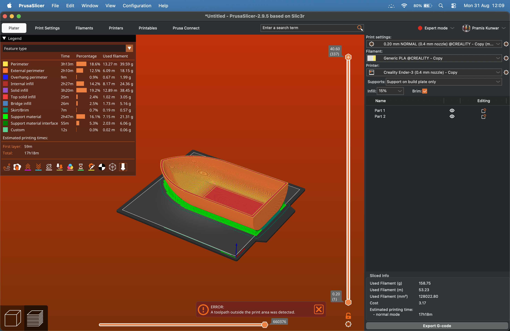

# RG-BOAT

**for hackclub forge**

---

---

Onshape link:  https://cad.onshape.com/documents/da58f6eb132e45c02884e7ef/w/f0726f7543996c3d286e1e4b/e/8387c688005734922322e3be?renderMode=0&uiState=6a95796252a2bebfd142f6c4

## what even is this

its a rc boat i designed in onshape. basically a 3d printed hull that floats and has space for electronics. nothing too crazy but it looks kinda cool ngl

---

## what i got so far

- hull design with curved front and hollow inside (0.25in walls)
  
---

---

- lid that fits on top with a lil overhang so water doesnt get in

---

---

- motor mounts and wire channels inside

took me like a week to figure out onshape but we got there eventually lol

---

## what still needs to happen

gotta actually buy parts and make it move:
- arduino or something similar
- motors + propellers
- esc 
- lipo battery 
- receiver for remote control

also gotta waterproof everything with silicone so it doesnt fry

---

# 🚤 RC BOAT — Bill of Materials (BOM)

> **USD conversion:** 1 USD = NPR 150  
> Prices are based on Daraz Nepal listings (subject to change).

| # | **[Component](ca://s?q=RC_boat_component_details)** | **Specification / Product** | **Qty.** | **Price (NPR)** | **Price (USD)** | **Link** |
|---|---|---|---:|---:|---:|---|
| 1 | **[3D Printing](ca://s?q=3D_printing_cost_RC_boat)** | PLA Filament — 158.75 g; estimated print time 17h 18m | 1 | **476** | **$3.17** | — |
| 2 | **[RC Transmitter + Receiver](ca://s?q=FlySky_FS-i6_for_RC_boat)** | FlySky FS-i6 2.4GHz 6CH + FS-iA6B Receiver | 1 Set | 9,000 | $60.00 | [Daraz FS-i6](https://www.daraz.com.np/products/flysky-fs-i6-24g-6ch-ppm-rc-transmitter-with-fs-ia6b-receiver-i133902948.html) |
| 3 | **[Brushless Motor](ca://s?q=A2212_1000KV_motor_for_RC_boat)** | A2212 1000KV Brushless Motor | 1 | 900 | $6.00 | [Daraz A2212](https://www.daraz.com.np/products/a221213t-1000-kv-brushless-motor-i125550186.html) |
| 4 | **[Motor ESC](ca://s?q=30A_ESC_for_RC_boat)** | 30A Brushless ESC, 2–3S | 1 | 999 | $6.66 | [Daraz ESC 30A](https://www.daraz.com.np/products/30a-brushless-esc-for-rc-fixed-wing-plane-helicopter-2-3s-i292619586.html) |
| 5 | **[Battery](ca://s?q=3S_LiPo_battery_for_RC_boat)** | 11.1V 4200mAh 3S LiPo | 1 | 8,500 | $56.67 | [Daraz LiPo Battery](https://www.daraz.com.np/products/111v-4200mah-3s-lipo-battery-120c-hard-case-lipo-battery-with-t-plug-for-rc-vehicles-rc-cartruck-rc-boat-i163642512.html) |
| 6 | **[Steering Servo](ca://s?q=MG90S_servo_for_RC_boat)** | MG90S Metal Gear Servo | 1 | 380 | $2.53 | [Daraz MG90S](https://www.daraz.com.np/products/mg90s-servo-motor-gear-i125719304.html) |
| 7 | **[Boat Propeller](ca://s?q=P40D47_RC_boat_propeller)** | P40D47 3-Blade RC Boat Propeller | 1–2 | 2,158 | $14.39 | [Daraz Propeller](https://www.daraz.com.np/products/3x-p40d47-three-blades-rc-boat-propeller-paddle-for-brushless-motor-i134836222.html) |
| 8 | **[Drive Shaft](ca://s?q=RC_boat_drive_shaft)** | 2mm Brass Drive Shaft + Coupler | 1 | 301 | $2.00 | [Daraz Shaft](https://www.daraz.com.np/products/accessories-boat-rc-parts-drive-shaft-2mm-5-connectors-brass-flexible-connector-coupling-coupler-motor-shaft-reducer-i174582688.html) |
| 9 | **[LiPo Charger](ca://s?q=IMAX_B3_charger_for_RC_boat)** | IMAX B3 Balance Charger, 2S/3S | 1 | 1,199 | $8.00 | [Daraz IMAX B3](https://www.daraz.com.np/products/imax-b3-balance-charger-for-lithium-lipo-battery-2s-3s-74v-12v-i128677485.html) |
| 10 | **[XT60 Connector](ca://s?q=XT60_connector_for_RC_boat)** | XT60 Male + Female Connector | 1 Pair | 199 | $1.33 | [Daraz XT60](https://www.daraz.com.np/products/connector-xt60-high-current-60a-connector-1-set-i174620184.html) |
| 11 | **[Rudder](ca://s?q=RC_boat_rudder)** | RC Boat Rudder + Steering Linkage | 1 | 500 | $3.33 | [Daraz Rudder](https://www.daraz.com.np/catalog/?q=RC%20boat%20rudder) |
| 12 | **[Silicone Wire](ca://s?q=RC_boat_silicone_wire)** | 14–16 AWG High-Current Wire | 1–2 m | 300 | $2.00 | [Daraz Silicone Wire](https://www.daraz.com.np/catalog/?q=14AWG%20silicone%20wire) |
| 13 | **[Fuse + Holder](ca://s?q=RC_boat_inline_fuse)** | 20–30A Inline Fuse | 1 | 200 | $1.33 | [Daraz Fuse](https://www.daraz.com.np/catalog/?q=30A%20inline%20fuse%20holder) |
| 14 | **[Waterproof Enclosure](ca://s?q=RC_boat_waterproof_enclosure)** | Waterproof Electronics Box | 1 | 500 | $3.33 | [Daraz Enclosure](https://www.daraz.com.np/catalog/?q=waterproof%20electronics%20box) |
| 15 | **[Boat Hull](ca://s?q=RC_boat_hull)** | 3D-Printed RC Boat Hull | 1 | 2,000 | $13.33 | [Daraz Hull](https://www.daraz.com.np/catalog/?q=RC%20boat%20hull) |

---

## 💰 Estimated Total

| Category | Amount |
|---|---:|
| **Components Subtotal** | **28,334 NPR** |
| **3D Printing Cost** | **476 NPR** |
| **TOTAL** | **28,810 NPR** |
| **TOTAL (USD)** | **$192.07** |

> **3D printing cost:** $3.17 × NPR 150 = **NPR 475.50 ≈ NPR 476**.
>
> **Printing estimate:** 158.75 g PLA filament and approximately **17 hours 18 minutes** of printing time, based on the PrusaSlicer estimate.

---

---

## why im doing this

honestly i just wanted to build something that actually moves. CAD was fun but seeing it in the water is gonna hit different. plus if this works i can add sensors and make it do cooler stuff later

wish me luck fr 
